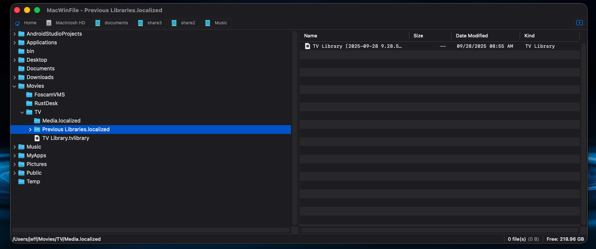
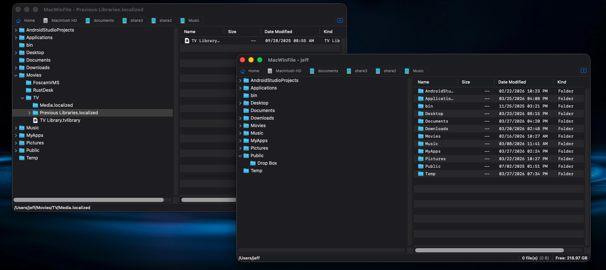

# MacWinFile

A native macOS file manager inspired by the classic Windows 3.1 File Manager (WinFile). Built with Swift, AppKit, and SwiftUI.

 

## Features

- **Dual-pane layout** — directory tree on the left, file list on the right (collapsible to single-pane)
- **Multiple windows** — open as many browser windows as you need
- **Drive toolbar** — quick access to Home and all mounted volumes; double-click to open in a new window
- **File operations** — copy, move, rename, delete (trash), create folders
- **Drag and drop** — between panes, between windows, and to/from Finder
- **Search** — recursive search with wildcard support (`*.txt`, `doc*`, `file?.pdf`)
- **Live updates** — directories auto-refresh when files change externally (via FSEvents)
- **Context menus** — right-click for quick actions on files and folders
- **Keyboard shortcuts** — Delete to trash, Enter to open, Cmd+C/V for copy/paste
- **Column sorting** — click column headers to sort by name, size, date, or kind
- **Status bar** — file count, selection size, and free disk space
- **Respects macOS appearance** — works with both light and dark mode
- **Remembers window size** — persists across app launches

## Screenshot


*Dual-pane file browsing with directory tree and file list*


*Multiple windows open side by side*

## Requirements

- macOS 14.0 (Sonoma) or later
- Apple Silicon (arm64)

## Building

No Xcode required — builds with just the Command Line Tools:

```bash
./build.sh
```

This compiles the app, generates the icon, code-signs it, and produces `build/MacWinFile.app`.

To run:

```bash
open build/MacWinFile.app
```

## Architecture

- **AppKit** for core views: `NSOutlineView` (tree), `NSTableView` (file list), `NSSplitView` (panes)
- **SwiftUI** for the status bar
- **FSEvents** for live directory watching
- **NSWorkspace** for file operations, icon loading, and Finder integration
- Each window is an independent `NSWindow` with its own drive toolbar and directory view

## Keyboard Shortcuts

| Shortcut | Action |
|----------|--------|
| Cmd+N | New Window |
| Cmd+O | Open Directory |
| Cmd+Shift+N | Create Folder |
| Cmd+F | Search |
| Cmd+I | Properties |
| Cmd+C | Copy |
| Cmd+V | Paste |
| Cmd+Shift+R | Reveal in Finder |
| Delete | Move to Trash |
| Enter | Open selected item |

## License

MIT License
